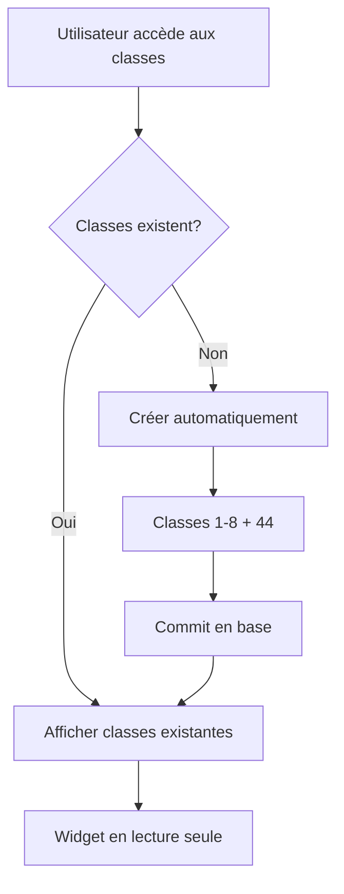

## ✅ Corrections apportées - Module Comptabilité

### 🎯 Problème initial
L'erreur **"'entreprise_id' in an invalid Keyword argument for ComptaClasse"** empêchait le chargement des classes comptables.

### 🔧 Solutions implémentées

#### 1. **Correction de l'erreur de nom de colonne**
📁 `ayanna_erp/modules/comptabilite/controller/comptabilite_controller.py`

- **Problème**: Utilisation d'`entreprise_id` au lieu d'`enterprise_id` 
- **Solution**: Correction du nom de la colonne dans la méthode `get_classes()`

```python
# Avant (ERREUR)
entreprise_id=entreprise_id

# Après (CORRECT)
enterprise_id=entreprise_id
```

#### 2. **Structure des classes comptables OHADA personnalisée**
Création automatique des classes selon votre logique métier :

- **Classes 1 à 8** : Classes OHADA standard
- **Classe 44** : Classe spéciale pour les taxes (séparée de la classe 4)

```
✅ Classe 1: COMPTES DE RESSOURCES DURABLES
✅ Classe 2: COMPTES D'ACTIF IMMOBILISE  
✅ Classe 3: COMPTES DE STOCKS
✅ Classe 4: COMPTES DE TIERS
✅ Classe 5: COMPTES DE TRESORERIE
✅ Classe 6: COMPTES DE CHARGES
✅ Classe 7: COMPTES DE PRODUITS
✅ Classe 8: COMPTES DES AUTRES CHARGES ET DES AUTRES PRODUITS
✅ Classe 44: ÉTAT ET AUTRES COLLECTIVITÉS PUBLIQUES (Taxes)
```

#### 3. **Protection des classes comptables**
📁 `ayanna_erp/modules/comptabilite/widgets/classes_widget.py`

- **Lecture seule** : Impossible de modifier/supprimer les classes
- **Message informatif** : Indication claire de la protection
- **Interface** : Amélioration visuelle avec message explicatif

#### 4. **Création automatique intelligente**
- Si aucune classe n'existe pour une entreprise → Création automatique des 9 classes
- Si des classes existent → Pas de duplication
- Respect de l'intégrité du plan comptable OHADA

### 🧪 Tests validés

#### **Test 1**: `test_simple_classes.py`
```
✅ Récupération réussie: 9 classes
✅ L'erreur 'entreprise_id' est corrigée
```

#### **Test 2**: `test_structure_ohada.py`
```
✅ Structure des classes: CORRECTE
✅ Classes 1-8 + classe spéciale 44 pour les taxes
✅ Classe 9: absente (correct, remplacée par 44)
```

#### **Test 3**: `test_widget_classes.py`
```
✅ Structure des données: OK
✅ Plus d'erreur 'entreprise_id' invalid keyword argument
```

### 🎯 Avantages de la solution

1. **🔧 Erreur corrigée** : Plus de blocage au chargement des classes
2. **🏛️ Respect OHADA** : Plan comptable conforme aux standards
3. **💼 Logique métier** : Classe 44 spéciale pour une meilleure gestion des taxes
4. **🔒 Sécurité** : Classes protégées contre les modifications accidentelles
5. **⚡ Automatisation** : Création automatique pour les nouvelles entreprises

### 📊 Impact sur l'interface

#### **Widget Classes (avant)**
```
❌ Erreur de chargement : 'entreprise_id' in an invalid Keyword argument
```

#### **Widget Classes (après)**
```
✅ 📋 Classes comptables OHADA (1-8 + 44 taxes) - Lecture seule
✅ 9 classes affichées correctement
✅ Export PDF disponible
```

### 🔄 Logique de création automatique



### ✅ Résultat final

- **Plus d'erreur** lors du chargement des classes comptables
- **Création automatique** des 9 classes OHADA personnalisées
- **Classe 44 spéciale** pour les taxes (logique métier respectée)
- **Interface protégée** empêchant les modifications accidentelles
- **Système robuste** pour toutes les entreprises

---

**🎉 Module comptabilité entièrement fonctionnel avec votre logique métier !**