## ✅ Corrections apportées - Filtrage des comptes par entreprise

### 🎯 Problème identifié
Les formulaires de **produits** et **services** du module Salle de Fête affichaient tous les comptes comptables de toutes les entreprises au lieu de filtrer uniquement ceux de l'entreprise courante.

### 🔧 Solutions implémentées

#### 1. **Modification du contrôleur de comptabilité**
📁 `ayanna_erp/modules/comptabilite/controller/comptabilite_controller.py`

- **Méthode modifiée**: `get_comptes_vente(entreprise_id=None)`
- **Changement**: Ajout d'un paramètre `entreprise_id` et jointure avec la table `compta_classes`
- **Filtrage**: Les comptes sont maintenant filtrés par `ComptaClasses.enterprise_id`

```python
# Avant
comptes = self.session.query(ComptaComptes).filter(
    ComptaComptes.numero.like('7%')
).order_by(ComptaComptes.numero).all()

# Après  
query = self.session.query(ComptaComptes).join(
    ComptaClasses, ComptaComptes.classe_comptable_id == ComptaClasses.id
).filter(
    ComptaComptes.numero.like('7%')
)

if entreprise_id:
    query = query.filter(ComptaClasses.enterprise_id == entreprise_id)
```

#### 2. **Modification du formulaire produit**
📁 `ayanna_erp/modules/salle_fete/view/produit_form.py`

- **Méthode modifiée**: `load_sales_accounts()`
- **Méthode ajoutée**: `get_enterprise_id()`
- **Changement**: Récupération de l'entreprise via `pos_id` et filtrage des comptes

```python
# Récupération de l'entreprise depuis le contrôleur
entreprise_id = self.get_enterprise_id()
comptes = comptabilite_controller.get_comptes_vente(entreprise_id=entreprise_id)
```

#### 3. **Modification du formulaire service**
📁 `ayanna_erp/modules/salle_fete/view/service_form.py`

- **Même corrections** que pour le formulaire produit
- **Méthode modifiée**: `load_sales_accounts()`
- **Méthode ajoutée**: `get_enterprise_id()`

### 🔗 Logique de récupération de l'entreprise

1. **Contrôleur** → `pos_id` (ID du point de vente)
2. **POS** → `enterprise_id` (via table `core_pos_points`)
3. **Filtrage** → Comptes de l'entreprise uniquement

```mermaid
graph LR
    A[Controller] --> B[pos_id]
    B --> C[POSPoint]
    C --> D[enterprise_id]
    D --> E[Comptes filtrés]
```



### 🧪 Tests créés et validés

#### **Test 1**: `test_account_filtering.py`
- ✅ Création de 2 entreprises test
- ✅ Création de classes et comptes comptables séparés
- ✅ Vérification du filtrage par entreprise
- ✅ Validation de l'isolation des données

#### **Test 2**: `test_form_account_filtering.py`  
- ✅ Test avec contrôleurs produit/service réels
- ✅ Vérification de la récupération d'entreprise via `pos_id`
- ✅ Validation du filtrage dans les formulaires

### 📊 Résultats des tests

```
🧪 Test du filtrage des comptes comptables par entreprise
============================================================
✅ Filtrage entreprise 1: OK
✅ Filtrage entreprise 2: OK
🎯 Le filtrage des comptes par entreprise fonctionne correctement.

🧪 Test du filtrage des comptes dans les formulaires
==================================================
✅ Entreprise récupérée: 1
📊 Nombre de comptes: 12 (filtrés par entreprise)
🎯 Les formulaires filtrent correctement les comptes par entreprise.
```

### 🎉 Impact de la correction

- **Avant**: Tous les comptes de toutes les entreprises étaient visibles
- **Après**: Seuls les comptes de l'entreprise courante sont affichés
- **Sécurité**: Isolation des données entre entreprises
- **UX**: Interface plus claire avec moins de choix non pertinents

### 📋 Fichiers modifiés

1. `ayanna_erp/modules/comptabilite/controller/comptabilite_controller.py`
2. `ayanna_erp/modules/salle_fete/view/produit_form.py`
3. `ayanna_erp/modules/salle_fete/view/service_form.py`

### ✅ Correction bonus

Aussi corrigé le **popup d'initialisation** qui s'affichait à chaque ouverture du module Salle de Fête :

📁 `ayanna_erp/modules/salle_fete/controller/mainWindow_controller.py`
- Ajout d'une vérification avant d'afficher le popup
- Le module n'affiche le popup que lors de la première initialisation

---

**✅ Toutes les corrections sont terminées et validées !**